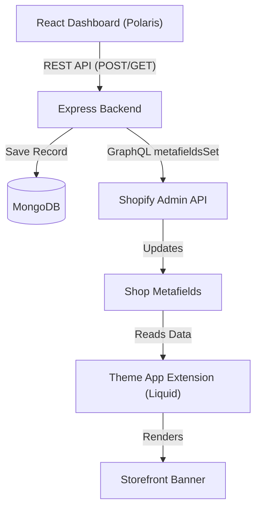

# Global Announcement Banner Shopify App

A professional, production-ready Shopify Embedded App built with MERN stack (MongoDB, Express, React, Node.js) and Shopify App Bridge. This app allows merchants to set a global announcement banner which synchronizes directly with their storefront using Shopify Shop Metafields and a Theme App Extension.

---

## 🏗️ Architecture Diagram



## 📁 Folder Structure

```
├── client/                     # React Frontend
│   ├── pages/index.jsx         # Polaris Dashboard
│   └── services/api.js         # API Fetch helpers
├── extensions/                 # Shopify Theme App Extensions
│   └── announcement-banner/    # Storefront Banner Liquid Block
├── server/                     # Node.js + Express Backend
│   ├── config/db.js            # MongoDB Connection
│   ├── models/                 # Mongoose Schemas (Announcement)
│   ├── controllers/            # Request handlers
│   ├── routes/                 # Express REST Routes
│   ├── services/               # Reusable Shopify/DB services
│   └── index.js                # Server entry point
└── package.json                # Project Dependencies
```

## ✨ Features

- **Professional Dashboard**: Built exclusively with Shopify Polaris components (Cards, IndexTable, Badges, etc.).
- **Announcement History**: View past announcements with seamless pagination and instant debounced search.
- **One-click Restore**: Bring back a previous announcement. Restoring creates a new history record to preserve audit logs.
- **Storefront Synchronization**: Pushes the text directly to Shopify Shop Metafields (`my_app.announcement`).
- **Dashboard Statistics**: See total announcements, sync success rates, and average character lengths.
- **System Status**: Real-time monitoring of MongoDB and Shopify GraphQL connectivity.
- **Data Export**: Export your announcement history to CSV or JSON formats.
- **Theme Extension**: A slide-down, fixed-top sticky banner with session-based dismissal (closes only for the current user session).

## 🚀 Installation

1. **Clone the repository.**
2. **Install dependencies:**
   ```sh
   npm install
   ```
3. **Set up Environment Variables (`.env`):**
   ```env
   SHOPIFY_API_KEY=your_api_key
   SHOPIFY_API_SECRET=your_api_secret
   SCOPES=write_products,read_products
   HOST=your_tunnel_url
   MONGO_URI=mongodb://localhost:27017/shopify
   ```
4. **Run the Application:**
   ```sh
   npm run dev
   ```

## 📊 MongoDB Schema

The `Announcement` model tracks the complete history and sync state:

```javascript
{
  shop: String,
  text: String,
  namespace: { type: String, default: "my_app" },
  key: { type: String, default: "announcement" },
  syncedToShopify: Boolean,
  shopifyMetafieldId: String
} // + timestamps (createdAt, updatedAt)
```

## 🔌 API Routes

| Method | Route | Description |
|--------|-------|-------------|
| `POST` | `/api/announcement` | Creates an announcement, syncs to Shopify, saves to Mongo |
| `GET`  | `/api/announcement/latest` | Gets the current active announcement |
| `GET`  | `/api/announcement/history` | Gets paginated history (`?page=1&limit=10&search=xyz`) |
| `GET`  | `/api/announcement/stats` | Fetches aggregate statistics |
| `GET`  | `/api/announcement/status` | Pings MongoDB and Shopify for connection status |

## 🔮 Future Improvements

- Add scheduling features (automatically deploy announcements on specific dates).
- Add color customization (let merchants choose banner color from the dashboard).
- Add multi-language support (syncing to localized metafields).

---
*Built as a professional Shopify Embedded App assignment.*
